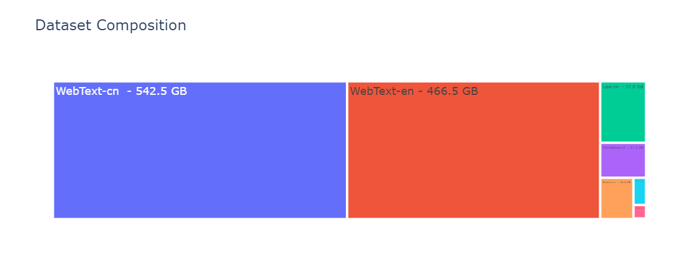

# 书生·万卷多模态预训练语料库


书生·万卷多模态预训练语料库是上海人工智能实验室（上海AI实验室）联合中央广播电视总台、人民网、国家气象中心、中国科学技术信息研究所等大模型数据联盟成员，联合打造的多知识、多模态、标准化的高质量语料数据，该语料库已覆盖通用及专用领域，总量超过10TB。

通用领域集纳跨模态、多领域、多语种知识语料，涵盖文本、语音、图像、视频、三维等多种数据模态；覆盖中文、英文、阿拉伯语和日语等200+种多语言；并支持语义理解、知识对话、内容创作、逻辑推理、代码生成等各类生成式任务；在数据的采集、加工和汇总建设上满足对数据的多样性、无害性和有益性的要求。

专用领域语料库针对特定行业而设，覆盖科学、医疗、教育、法律、交通等领域，并基于各领域的数据特征和形式，构建了专业分类体系。科学方面，包含物质科学、气象领域和生物科学等大规模科研数据；医疗方面不仅覆盖的广泛医疗知识，还包括不同模态的医疗影像及多种疾病的诊断数据；教育方面包含从初、中、高等教育及职业教育各阶段的教材教辅和试题等数据。

## 书生·万卷1.0

基于大模型数据联盟构建的语料库，上海AI实验室对其中部分数据进行细粒度清洗、去重以及价值对齐，形成了书生·万卷1.0，具备多元融合、精细处理、价值对齐、易用高效等四大特征。

- 在多元融合方面，书生·万卷1.0包含文本、图文、视频等多模态数据，范围覆盖科技、文学、媒体、教育、法律等多个领域，在训练提升模型知识含量、逻辑推理和泛化能力方面具有显著效果。
- 在精细处理方面，书生·万卷1.0经历了语言甄别、正文抽取、格式标准化、基于规则及模型的数据过滤与清洗、多尺度去重、数据质量评估等精细化数据处理环节，因而能更好地适配后续的模型预训练需求。
- 在价值对齐方面，研究人员在书生·万卷1.0的构建过程中，着眼于内容与中文主流价值观的对齐，通过算法与人工评估结合的方式，提升了语料的纯净度。
- 在易用高效方面，研究人员在书生·万卷1.0采用统一格式，并提供详细的字段说明和工具指导，使其兼顾了易用性和效率，可快速应用于语言、多模态等大模型预训练。

书生·万卷1.0为书生·万卷多模态预训练语料库的首个开源版本，包含了书生·万卷文本数据集、书生·万卷图文数据集、书生·万卷视频数据集三部分，数据总量超过1.9TB。

目前，书生·万卷1.0已被应用于书生·多模态、书生·浦语的预训练。通过对高质量语料的“消化”，书生系列模型在语义理解、知识问答、视觉理解、视觉问答等各类生成式任务表现出的优异性能。

### 书生·万卷文本数据集1.0
- 简介

书生·万卷文本数据集1.0由来自网页、百科、书籍、专利、教材、考题等不同来源的清洗后预训练语料组成，数据总量超过5亿个文档，数据大小超过1TB。该语料将html、text、pdf、epub等多种格式的数据统一处理为字段统一的jsonl格式，并经过细粒度的清洗、去重、价值对齐，形成了一份安全可信、高质量的预训练语料。

- 组成



- 样例

```json
{
    "id": "BkORdv3xK7IA0HG7pccr",
    "content": "\\*诗作[222]\n录自索菲娅·马克思的笔记本\n#### 人生\n时光倏忽即逝，\n宛如滔滔流水；\n时光带走的一切，\n永远都不会返回。\n生就是死，\n生就是不断死亡的过程；\n人们奋斗不息，\n却难以摆脱困顿；\n人走完生命的路，\n最后化为乌有；\n他的事业和追求\n湮没于时光的潮流。\n对于人的事业，\n精灵们投以嘲讽的目光；\n因为人的渴望是那样强烈，\n而人生道路是那样狭窄迷茫；\n人在沾沾自喜之后，\n便感到无穷的懊丧；\n那绵绵不尽的悔恨\n深藏在自己的心房；\n人贪婪追求的目标\n其实十分渺小；\n人生内容局限于此，\n那便是空虚的游戏。\n有人自命不凡，\n其实并不伟大；\n这种人的命运，\n就是自我丑化。\n卡尔·马克思\n#### 查理大帝\n使一个高贵心灵深受感动的一切，\n使所有美好心灵欢欣鼓舞的一切，\n如今已蒙上漆黑的阴影，\n野蛮人的手亵渎了圣洁光明。\n巍巍格拉亚山的崇高诗人，\n曾满怀激情把那一切歌颂，\n激越的歌声使那一切永不磨灭，\n诗人自己也沉浸在幸福欢乐之中。\n高贵的狄摩西尼热情奔放，\n曾把那一切滔滔宣讲，\n面对人山人海的广场，\n演讲者大胆嘲讽高傲的菲力浦国王。\n那一切就是崇高和美，\n那一切笼罩着缪斯的神圣光辉，\n那一切使缪斯的子孙激动陶醉，\n如今却被野蛮人无情地摧毁。\n这时查理大帝挥动崇高魔杖，\n呼唤缪斯重见天光；\n他使美离开了幽深的墓穴，\n他让一切艺术重放光芒。\n他改变陈规陋习，\n他发挥教育的神奇力量；\n民众得以安居乐业，\n因为可靠的法律成了安全的保障。\n他进行过多次战争，\n杀得尸横遍野血染疆场；\n他雄才大略英勇顽强，\n但辉煌的胜利中也隐含祸殃；\n他为善良的人类赢得美丽花冠，\n这花冠比一切战功都更有分量；\n他战胜了那个时代的蒙昧，\n这就是他获得的崇高奖赏。\n在无穷无尽的世界历史上，\n他将永远不会被人遗忘，\n历史将为他编织一顶桂冠，\n这桂冠决不会淹没于时代的激浪。\n卡尔·马克思于1833年\n#### 莱茵河女神\n**叙事诗**\n(见本卷第885—889页)\n#### 盲女\n**叙事诗**\n(见本卷第852—858页)\n#### 两重天\n**乘马车赴柏林途中**\n(见本卷第475—478页)\n#### 父亲诞辰献诗。1836年\n**(见本卷第845—846页)**\n#### 席勒\n**十四行诗两首**\n(见本卷第846—847页)\n#### 歌德\n**十四行诗两首**\n(见本卷第848—849页)\n#### 女儿\n**叙事诗**\n(见本卷第838—841页)\n#### 凄惨的女郎\n**叙事诗**\n(见本卷第533—537页)\n卡·马克思写于1833年一大约1837年\n第一次用原文发表于《马克思恩格斯全集》1975年历史考证版第1部分第1卷\n并用俄文发表于《马克思恩格斯全集》1975年莫斯科版第40卷\n原文是德文\n中文根据《马克思恩格斯全集》1975年历史考证版第1部分第1卷翻译\n---\n**注释：**\n[222]马克思的这些诗作是他的姐姐索菲娅抄录在一个笔记本里的。除了马克思的诗作外，笔记本里还有其他人的诗作以及索菲娅自己和她的亲友的个人记事。马克思的这些诗作，除了《人生》和《查理大帝》外都在马克思的几本诗集和索菲娅的纪念册里出现过。《查理大帝》一诗注明写作日期是1833年，可见马克思早在中学时代就已开始写诗了。《盲女》注明写作日期是1835年。为祝贺父亲生日而献给亨利希·马克思的诗作的写作日期应该不晚于1836年初。——913。"
}
```

- 字段

  - id: 【字符串类型】文档的唯一ID。
  - content: 【字符串类型】文档的内容，格式为普通Text格式或Markdown格式。

### 书生·万卷图文数据集1.0

- 简介

书生·万卷图文数据集1.0数据主要来自公开网页，经处理后形成图文交错文档。文档总量超过2200万个，数据大小超过140GB（不含图片），覆盖新闻事件、人物、自然景观、社会生活等多个领域。数据均为统一的jsonl格式，其中图片以url的形式给出，若需获取图片数据，可以采用以下脚本：https://github.com/opendatalab/image-downloader

- 样例

```json
{
    "id": "BkKuk1zxK3YAbgNSWYik",
    "img_list": [
        {
            "url": "http://digitalpaper.stdaily.com/http_www.kjrb.com/kjrb/images/2021-01/21/02/1007771_wangjj_1611154300505_b.jpg",
            "sha256": "019cca88f37ae5ffe59ad48ad5c392fe64e489f08e841b6ea50c79c18f5c6ec3",
            "caption": "",
            "width": "400",
            "height": "266"
        }
    ],
    "content": "\n奋斗百年路 启航新征程\n走进觉悟社当年社员开会的房间，桌子中间摆放的一盘纸条格外引人注目，周恩来“伍豪”和邓颖超“逸豪”的笔名就诞生于此。\n“为了斗争的需要，觉悟社社员们采取抓阄的办法，以号取名。”1月19日，天津觉悟社纪念馆助理馆员迟爱民讲述了102年前的情景：当时年纪最小的邓颖超抓到了最小数字1号，所以叫“逸豪”。周恩来抓到5号，就取名“伍豪”。\n时间回到1919年那个思潮澎湃的年代。在天津，以周恩来为代表的一批以天下为己任的先进分子，在众多新思潮中艰难地探索革命真理。通过觉悟社的锻炼和洗礼，其主要成员成长为我国早期的共产主义者。周恩来也在这个时期成为马克思主义的宣传者。\n诞生：冲破封建束缚探索革命真理\n觉悟社成立于“五四运动”在天津发展到最高潮的阶段。\n觉悟社纪念馆中的一张合影，记录下了这一张张充满青春朝气的脸庞。他们神色凝重，目光坚定，这些人就是觉悟社成立之初的部分社员。\n“这个比一般学生爱国团体更加严密的组织的成立，源于之前一次赴京请愿斗争。”迟爱民介绍，1919年9月2日，周恩来等天津各界联合会、学生联合会、女界爱国同志会的先进青年在返津途中，经过交流，一致认为，应该成立一个研究新思潮，探索革命真理，冲破封建习俗束缚，由男女同学共同组建的团体。\n1919年9月16日，在天津东南角草场庵天津学生联合会办公室里，革命青年团体觉悟社诞生了。出席成立会的男女各10名成员成为最初的社员，包括周恩来、邓颖超、马骏、刘清扬、郭隆真等。\n周恩来执笔起草了《觉悟的宣言》。觉悟社成立后，以“革心”和“革新”的精神组织演讲，出版刊物《觉悟》，探讨研究新思潮，很快就成为天津学生爱国运动的中坚力量。\n引领：觉悟社成立5天后李大钊应邀前来\n在波澜起伏的斗争中，周恩来和觉悟社社员们迫切感到，要用先进思想武装头脑。\n觉悟社社员谌小岑曾回忆道，在觉悟社成立后第5天，我国最早的马克思主义者、中国共产党先驱李大钊就应邀到觉悟社座谈。李大钊听完邓颖超对觉悟社的介绍后，对觉悟社深表赞许，他表示“觉悟社是男女平等、社交公开的先行”。\n在李大钊的启发下，觉悟社成员阅读了李大钊发表在《新青年》上的《庶民的胜利》《布尔什维主义的胜利》《我的马克思主义观》等文章。还邀请徐谦、包世杰、钱玄同、刘半农等来演讲，并召开讨论会。\n天津市委党校文史教研部副主任徐娜表示，觉悟社社员们学习、讨论中国最早的马列主义文献，并积极投身实践斗争，为他们选择信仰马克思主义、走上共产主义道路进行了最初的启蒙与引导。\n影响：觉悟社多人加入中国共产党\n1920年1月29日，在抵制日货的斗争中，周恩来、马骏等人被捕，成立仅4个月的觉悟社受到沉重打击。纪念馆展厅中的两本书《警厅拘留记》和《检厅日录》，记录了青年们斗争的艰难和残酷。身陷囹圄的周恩来先后用6个晚上，向狱友介绍马克思主义学说。出狱后，编写了3.5万字的《警厅拘留记》和《检厅日录》。在后来旅法期间，周恩来说“我的思想是颤动于狱中”，可以说这是周恩来马克思主义世界观形成的重要时期。\n1920年11月，随着周恩来、刘清扬、郭隆真等人赴法国勤工俭学，觉悟社的社员们开始星散，觉悟社的集体活动停止……\n觉悟社存在的时间虽然不长，但为一批年轻人树立马克思主义信仰奠定了坚实基础。徐娜表示，觉悟社作为“五四”运动爆发之后在天津影响最广泛、作用最突出的进步学生组织，其表现出的反对封建主义、憎恨一切剥削和压迫的进步思想，为接受马克思主义作好了准备。随后，远赴欧洲勤工俭学的周恩来加入中国共产党八个发起组之一的巴黎共产主义小组，成为中国共产党创建人之一，而其他的觉悟社主要社员如马骏、邓颖超、郭隆真等都加入了中国共产党，成为革命的骨干力量。"
}
```

- 字段

  - id: 【字符串类型】文档的唯一ID。
  - img_list：【数组类型】，文档内包含的图片列表。每张图片的信息包括网络url, url的sha256, 长度和宽度。
  - content: 【字符串类型】文档的内容，格式为普通Text格式或Markdown格式。

### 书生·万卷视频数据集1.0

- 简介

书生·万卷视频数据集1.0由央视贡献，包含多种类型的节目影像，总计视频文件数1074 个，数据大小超过800GB。内容覆盖军事、文艺、体育、自然、真实世界、知识类、影像艺术、媒体、美食、历史纪录片、科教类等方面。

- 组成


## 许可

书生·万卷1.0整体采用CC BY 4.0许可协议。您可以自由共享、改编该数据集，唯需遵循以下条件：

- 署名：您必须适当地标明作者、提供指向本协议的链接，以及指明是否（对原始数据集）做了修改。您可以以任何合理的方式这样做，但不能以任何方式暗示许可人同意您或您的使用。

- 没有附加限制：您不得使用法律条款或技术措施来限制他人执行许可证允许的任何操作。

完整协议内容，请访问[CC BY 4.0协议全文](https://creativecommons.org/licenses/by/4.0/)。

### 特别注意事项

请注意，本数据集的某些子集可能受制于其他协议规定。在使用特定子集之前，请务必仔细阅读相关协议，确保合规使用。更为详细的协议信息，请在特定子集的相关文档或元数据中查看。

（OpenDataLab）倡导和谐友好的开源交流环境，若在开源数据集内发现有侵犯您合法权益的内容，可发送邮件至（OpenDataLab@pjlab.org.cn），邮件中请写明侵权相关事实的详细描述并向我们提供相关的权属证明资料。我们将于3个工作日内启动调查处理机制，并采取必要的措施进行处置。但您应确保您投诉的真实性，否则采取措施后所产生的不利后果应由您独立承担。


## 引文

```
@misc{conghui2022opendatalab,
  title={OpenDataLab: Empowering General Artificial Intelligence with Open Datasets},
  author={Conghui He, Wei Li, Zhenjiang Jin, Bin Wang, Chao Xu, Dahua Lin},
  journal={https://opendatalab.com/},
  year={2022}
}
```

